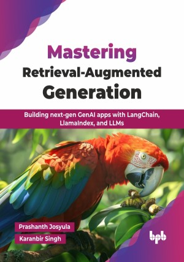

# Mastering Retrieval-Augmented Generation

Building next-gen GenAI apps with LangChain, LlamaIndex, and LLMs.

This is the repository for [Mastering Retrieval-Augmented Generation
](https://bpbonline.com/products/mastering-retrieval-augmented-generation?_pos=1&_sid=95c0f2400&_ss=r?variant=44551075365064),published by BPB Publications.

## About the Book
Large language models (LLMs) like GPT, BERT, and T5 are revolutionizing how we interact with technology — powering virtual assistants, content generation, and data analysis. As their influence grows, understanding their architecture, capabilities, and ethical considerations is more important than ever. This book breaks down the essentials of LLMs and explores retrieval-augmented generation (RAG), a powerful approach that combines retrieval systems with generative AI for smarter, faster, and more reliable results.

It provides a step-by-step approach to building advanced intelligent systems that utilize an innovative technique known as the RAG thus making them factually correct, context-aware, and sustainable. You will start with foundational knowledge — understanding architectures, training processes, and ethical considerations — before diving into the mechanics of RAG, learning how retrievers and generators collaborate to improve performance. The book introduces essential frameworks like LangChain and LlamaIndex, walking you through practical implementations, troubleshooting, and optimization techniques. It explores advanced optimization techniques, and offers hands-on coding exercises to ensure practical understanding. Real-world case studies and industry applications help bridge the gap between theory and implementation. 

By the final chapter, you will have the skills to design, build, and optimize RAG-powered applications — integrating LLMs with retrieval systems, creating custom pipelines, and scaling for performance. Whether you are an experienced AI professional or an aspiring developer, this book equips you with the knowledge and tools to stay ahead in the ever-evolving world of AI.

## What You Will Learn
• Understand the fundamentals of LLMs.

• Explore RAG and its key components.

• Build GenAI applications using LangChain and LlamaIndex frameworks.

• Optimize retrieval strategies for accurate and grounded AI responses.

• Deploy scalable, production-ready RAG pipelines with best practices.

• Troubleshoot and fine-tune RAG pipelines for optimal performance.
